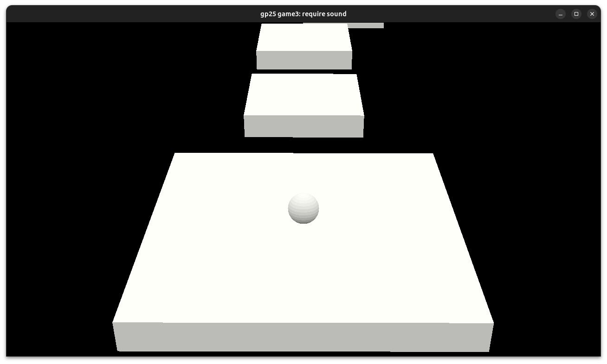

# Jump the boom

Author: Matteo Jeulin (mjeulin)

Design: This game is a challenging platformer where every jump's timing counts.

Screen Shot:

How To Play:

The goal of the game is to reach the last platform. The player must not be on the ground when the explosion happens or else they lose.
The controls are WASD or the arrow keys to move, the mouse to look around, R to restart and M to mute the music.

This game was built with [NEST](NEST.md).
